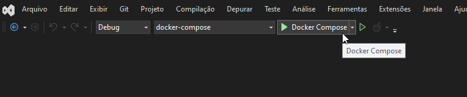

# SelfieBurguer API

> Aplicação elaborada para o usuário realizar o autoatendimento do seu pedido sem a necessidade de interação com um atendente real. Trazendo celeridade e eficiência ao processo de escolha de produtos. Através da aplicação, os usuários podem escolher e conferir o status de seus pedidos de forma rápida e intuitiva, eliminando possíveis esperas e garantindo uma experiência conveniente.

<br>

## Stack

Na sua primeira versão, este projeto foi impulsionado pelo Docker Compose, já na segunda versão, a atual, é impulsionado pelo Kubernets.

Basicamente, ambas as versões constróem localmente a estrutura responsável pela execução da aplicação através dos containers:
1. SQL Server e carga de dados para a construção do banco
2. Web-Api em .NET 6, implementada com arquitetura hexagonal e Domain Driven Design

A proposta de desenvolvimento foi de manter uma arquitetura enxuta e escalável, refletindo constantemente as tendências mais modernas no contexto da Arquitetura de Software.

<br>

``🧑‍💻 Fluxo de desenvolvimento``: https://trello.com/b/nBPrMB9f/selfieburguer

<br>


## Formas de executar a aplicação:


<details>
<summary>Executar via Kubernets 👆</summary>

É necessário ter o `kubectl` e o `kind` instalados para seguir com os procedimentos a seguir.

O `kubectl` é o utilitário de linha de comando que permite interagir com clusters `Kubernetes`. Já o `kind` permite que você execute o Kubernetes no seu **computador local**. Estas ferramentas requerem que você tenha o `Docker` instalado e devidamente configurado

Siga a documentação oficial para instalar: https://kubernetes.io/pt-br/docs/tasks/tools/

<br>

Após clonar o projeto, abra-o em um terminal de sua preferência, acesse o diretório raiz e execute o seguinte comando: `./ambiente-scripts/k8s-iniciar.sh`.

Explicando, o comando acima cria/atualiza os recursos no cluster de acordo com as definições fornecidas nos manifestos `yaml`:

```sh
kubectl apply -f k8s/mssql-deployment.yaml;
kubectl apply -f k8s/mssql-service.yaml;
kubectl apply -f k8s/app-deployment.yaml;
kubectl apply -f k8s/app-service.yaml
```

Caso a execução tenha sido realizada com sucesso, a aplicação estará executando localmente na sua máquina. Para conferi-la, acesse no seu navegador: http://localhost/swagger

Caso não tenha funcionado, você precisará criar uma conexão direta entre uma porta local em sua máquina e uma porta dentro de um pod em execução. Para isto, utilize o recurso 'port-forward': 

Volte ao terminal e execute: `kubectl port-forward service/app-service 32386:80`

Vá até o navegador e acesse a url com a porta `32386` mapeada: http://localhost:32386/swagger

> Explicando: Dependendo da ferramenta escolhida para executar o Kubernets localmente, pode haver particularidades nas tentativas de acessar o container pelas diferentes portas informadas. Por isso mantenho as duas soluções neste passo a passo.

<br>

</details>


<details>
<summary>Executar via Docker-Compose 👆</summary>

## 👨‍💻 Instruções de execução no terminal
Abra o terminal de sua preferência, clone o projeto e acesse o diretório raiz.

Execute o comando `./ambiente-scripts/dcompose-iniciar.ps1` (Windows com WSL2) ou `./ambiente-scripts/dcompose-iniciar.sh` (Linux e Mac) para buildar a aplicação:

```sh
# Os arquivos de script "ambiente-scripts/dcompose-iniciar.ps1" e "ambiente-scripts/dcompose-iniciar.sh" executam:
docker-compose -f .\docker-compose.yml up
```

<div style="text-align:center;">
	
</div>

<br>
<br>

Abra seu navegador e acesse a documentação da aplicação pela url `http://localhost:8001/swagger`.

<div style="text-align:center;">
	
</div>

<br>
<br>

⚠️ Para finalizar os containers, digite `CTRL+C` no terminal e em seguida execute o comando `./ambiente-scripts/dcompose-parar.ps1` (Windows com WSL2) ou `./ambiente-scripts/dcompose-parar.sh` (Linux e Mac).

```sh
# Os arquivos de script "ambiente-scripts/dcompose-parar.ps1" e "ambiente-scripts/dcompose-parar.sh" executam:
docker-compose -f .\docker-compose.yml down ; docker rm $(docker ps -q --filter status=exited) ;  docker ps -a
```

<div style="text-align:center;">
	
</div>
<hr>
<br>

## 🆚 Instruções de execução no visual studio
No Gerenciador de Soluções, localize o arquivo `docker-compose`:
<div style="text-align:center;">
	
</div>

<br>
<br>


Clique com o botão direito em cima dele e marque a opção "Definir projeto de inicialização":
<div style="text-align:center;">
	
</div>

<br>
<br>

Em seguida, clique no ícone de "play" verde do Docker Compose, localizado no centro superior da IDE:
<div style="text-align:center;">
	
</div>

<br>
<br>

Aguarde alguns instantes até que o navegador abra automaticamente o swagger da aplicação.

</details>
